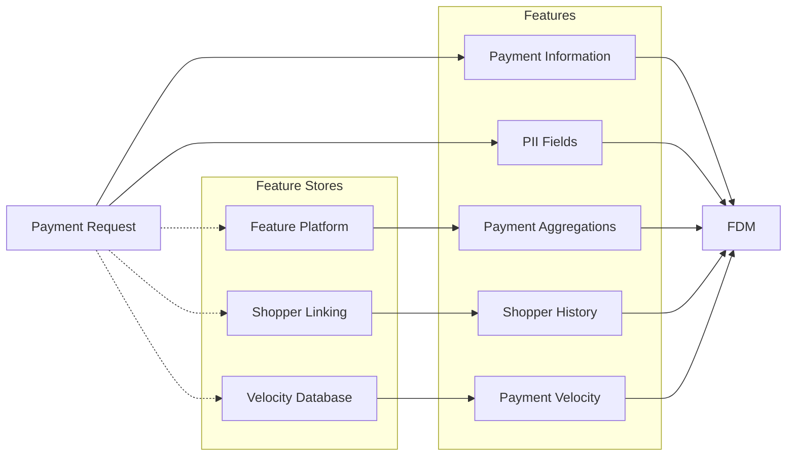
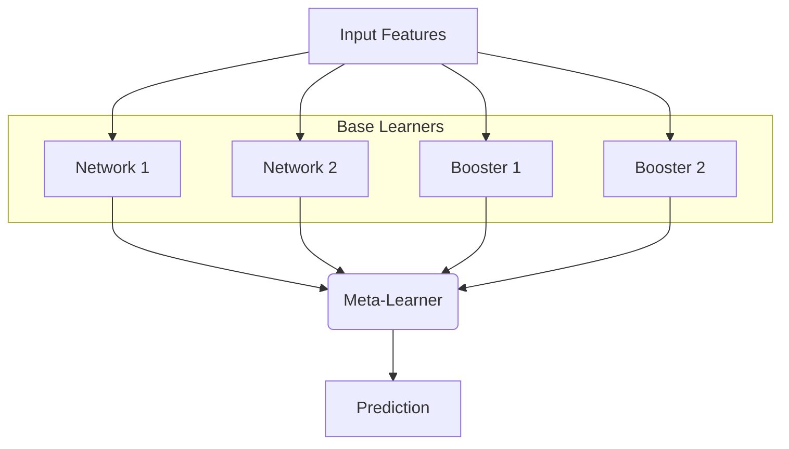
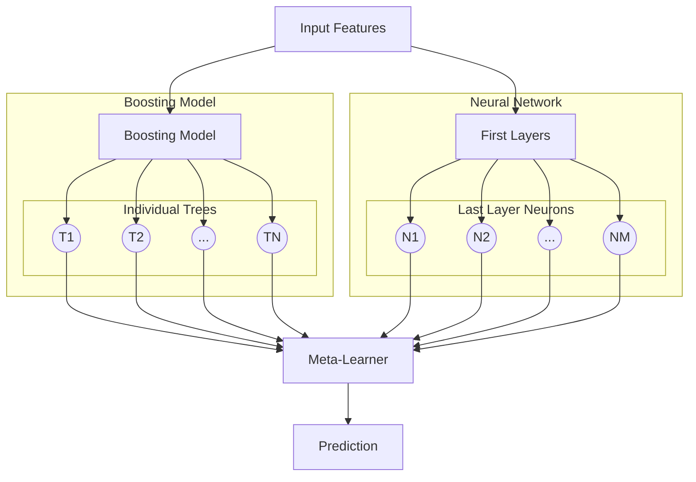
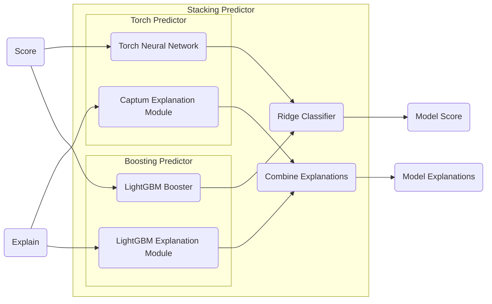

It is a widely held belief in the ML community that tree-based models are the only sensible choice for tabular data. Adoption of neural networks for these tasks is usually met with skepticism about their applicability (e.g., latency concerns, GPU usage at inference time, explainability) and performance, since trees typically excel at predictions on tabular data.

These concerns are not entirely unfounded, but are often rooted in two issues. Regarding performance, benchmarks usually stem from small-scale academic datasets that favor tree methods and under-resource neural networks. Regarding feasibility, deep learning tends to be conflated with large language models, which require massive infrastructure, multi-billion-parameter models, and complex serving stacks.

In this post, we present a real-world case study from Company, a global payments processor. We describe how we migrated our flagship fraud detection model, scoring thousands of transactions per second, from a large, well-tuned boosting model to a pure neural network. We also outline why we believe that, at scale, neural networks can not only match but also outperform gradient-boosted trees on tabular data, and bring substantial ancillary benefits.

The transition was not a one-shot replacement. We went through an intermediate ensembling process that improved performance and reduced migration risk before we could fully transition and consolidate on a pure deep learning model. Along the way, we tried many tabular DL architectures from the literature, observed surprising results at our scale, and leaned heavily on intermediate ensembling and pragmatism to deploy the model in production.
This report outlines the results and lessons we encountered during this transition.

## Background - Fraud Detection at Company

Company processes large volumes of payments for merchants worldwide.
A key part of this process is our Fraud Detection Model (FDM), which estimates in real time the likelihood that a payment is fraudulent and approves, challenges, or blocks it accordingly.
The cost of errors is high: blocking legitimate payments hurts merchants' authorization rates and shoppers' experience, while approving fraudulent ones leads to significant financial losses for merchants.

Our fraud detection model consumes a large, evolving feature set combining:

- Basic payment-level features
- Aggregate features, such as rolling statistics across many merchant and shopper dimensions, served by our feature platform.
- Shopper features, such as histories of payments, refusals, and identifiers across all of our merchants and regions, served by our shopper linking algorithm.
- Velocity features, such as the number of payment attempts across multiple dimensions, served as timestamp arrays by our velocity database.
- Structured fields containing payment information in raw string format.

FDM’s ML stack was originally built on a large boosting model based on LightGBM: it was easy to adopt, simple to scale, and excellent on tabular data. 
As a result, model choice wasn’t an immediate bottleneck; most gains came from feature engineering, deeper platform integration, and expanding model scope, which made deep learning hard to prioritize.

Still, we knew a switch would eventually be needed to unlock uplift beyond what boosting could deliver. 
Many FDM inputs are naturally structured sequences (timestamps, past payments) or raw text. While careful feature engineering helped (e.g., rolling-window shopper aggregates, proxy email features), these signals weren’t fully exploited.
Growth also created operational pressure: rising payment volume and feature count strained out-of-core training and constant-memory inference.
At the same time, the company’s long-term strategy emphasized deep learning—foundational payments models, model unification, and multi-task learning.

We concluded that a well-designed neural network could outperform given the right scale and infrastructure, but a hard cutover from a trusted boosting model would be risky.

## Heterogeneous Ensembling as a Migration Strategy

The observation that tree-based models typically outperform neural networks on tabular data has been explored in recent work<d-cite key="gorishniy2023revisitingdeeplearningmodels"></d-cite><d-cite key="chen2023tromptbetterdeepneural"></d-cite>.
This performance gap is often explained by a few key arguments.
One is *smoothness bias*, where standard NNs favor smooth decision boundaries, which can be a poor fit for the piecewise-constant structures common in tabular problems.
Another is *rotational invariance*, as NNs are generally rotation-invariant while trees are sensitive to axis-aligned splits.
Finally, there is the issue of *scale* since trees are sample efficient and handle small to medium datasets extremely well, whereas NNs often require more data and/or careful regularization.

The literature also suggests remedies to these limitations, including discretization and binning, embeddings for numerical features, attention-based architectures to mitigate rotational invariance, and augmentation with large-scale training to exploit NNs as universal approximators.

We took inspiration from these ideas, but also from industry case studies where NNs or heterogeneous ensembles beat boosting models in production.
Migration narratives from ShareChat<d-cite key="Jeunen_2023"></d-cite> for short-video recommendations, Swiggy<d-cite key="swiggy2021learningtorank"></d-cite> for restaurant ranking, Stripe <d-cite key="stripe2020howwebuiltitstriperadar"></d-cite> for payment fraud detection, and internal anecdotes from eBay all point to a similar pattern of leveraging heterogeneous ensembling (stacking) as a temporary model instead of directly migrating from boosting to neural networks.

Our production boosting models were already a form of ensembling (albeit homogeneous), as they combine many similar weak trees into a strong model.
This approach could be extended through heterogeneous ensembling, in which multiple classes of learners, such as boosting models and neural networks, are combined to solve the same task.
Ensembling approaches (e.g., bagging, boosting, stacking) have been extremely effective at winning competitions on tabular data <d-cite key="erickson2025tabarenalivingbenchmarkmachine"></d-cite><d-cite key="holzmüller2025betterdefaultstrongpretuned"></d-cite>.
This illustrates the *No Free Lunch* theorem, which suggests that no single model class can dominate on all learning tasks.
We eventually chose to explore heterogeneous ensembling through stacking, in which diverse learners are trained to solve a task, and a meta-learner is trained on the same task using the learners' predictions as input features.

Aside from usually yielding superior performance compared to single learner classes, stacking also provides a valuable and safe blueprint for transitioning to deep learning.
A simple stacking of our current boosting models with a fairly basic neural network could result in direct but moderate performance uplift.
We could then gradually improve the neural network while serving it within a stacking model in production until it was strong enough to be deployed on its own, ensuring a smooth transition and incremental performance gains.

Of course, this approach would first have to be validated experimentally on our large fraud detection dataset before this transition plan could be enacted.

## Transition Process

The complete transition of our fraud detection models from ML to DL ranged from October 2024 to September 2025.
Given the uncertainties regarding the performance and deployability of neural networks and stacking models, we avoided a large-scale monolithic migration and instead focused on shorter, iterative experiments.

### Offline Experiments

We ran an initial feasibility study to evaluate whether a neural network would outperform our current boosting model for fraud detection on our offline benchmarks.
Even though feature pruning and engineering efforts seemed promising for bringing additional uplift to neural networks, we kept the experiment's scope simple by comparing models on the current production feature set.

We built a lightweight experimentation loop focused on rapid iteration rather than production readiness.
We initially leveraged the [PyTorch Frame](https://github.com/pyg-team/pytorch-frame) <d-cite key="hu2024pytorch"></d-cite> library, which conveniently collects popular NN architectures for tabular data from the literature, ranging from simple MLP and ResNet<d-cite key="gorishniy2023revisitingdeeplearningmodels"></d-cite> architectures to novel solutions such as FT-Transformer (attention-based models for tabular data)<d-cite key="gorishniy2023revisitingdeeplearningmodels"></d-cite>, TabNet<d-cite key="arik2020tabnetattentiveinterpretabletabular"></d-cite>, and ExcelFormer <d-cite key="chen2024excelformerneuralnetworksurpassing"></d-cite>.
The library also includes several popular encoding schemes for numerical and categorical features.
This allowed us to iterate over these architectures to see how they adapted to our problem space and scale.

After running multiple training and tuning experiments, we observed that neural networks overall underperformed by 18% to 30% on our internal metrics versus our boosting baselines across a combination of architectures and encoding schemes:

- On the architecture side, we surprisingly observed that performance metrics did not significantly differ across architectures: simple architectures such as MLP and ResNet were just as good (or, in this case, just as bad) as complex ones such as FT-Transformer or TabNet, although the latter were shown to bring significant performance uplift on smaller benchmarks <d-cite key="rubachev2024tabredanalyzingpitfallsfilling"></d-cite>. Furthermore, model training time increased significantly with the complexity of the architectures on our then fairly immature GPU cluster, rendering the training of some architectures, like ExcelFormer, prohibitively time-consuming.

- On the encoding side, we found that an adequate encoding scheme for numerical and categorical features was essential for acceptable performance from neural networks. Here again, complex encoding schemes such as piecewise linear encoding or numerical embeddings <d-cite key="gorishniy2023embeddingsnumericalfeaturestabular"></d-cite> did not bring uplift and sometimes significantly increased training time. A simple combination of standard scaling and masking missing values for numerical features, and learned embeddings for categorical features, gave the best results.

This first run of experiments allowed us to settle, quite surprisingly, on the simplest available architecture: a wide, shallow MLP of around 10M parameters.
This architecture yielded superior performance among the architectures we could train (in a close tie with ResNet) and trained relatively fast, taking around 10 hours at the time to converge on our training sets.

The surprising finding that a simple MLP was the most stable and scalable architecture for our problem shifted our strategy from finding the best architecture to making a simple architecture good at scale and matches recent findings in the literature <d-cite key="holzmüller2025betterdefaultstrongpretuned"></d-cite><d-cite key="He2014PracticalLF"></d-cite>.

### Ensembling as a Bridge

We then turned our efforts to the stacking strategy that would best complement the MLP architecture.
We used a simple ridge classifier as our meta-learner and compared two popular forms of stacking:
- A *simple* stacking scheme in which the predictions of the MLP and the boosting model are fed as two inputs to the meta-learner. This is the most basic form of stacking, as the meta-learner receives only two input features with no extra information about the sample it is scoring.
- A *deep* stacking scheme in which the predictions of each individual tree from the booster and activations from the second-to-last layer of the MLP are fed to the meta-learner. This allows for a richer representation of the underlying sample being scored <d-cite key="He2014PracticalLF"></d-cite>.

While stacking models added complexity to the codebase, training them was extremely quick and straightforward.
Both forms of stacking showed uplift compared to our standalone MLP trained in our first experimental round, which was somewhat expected.
However, their individual performance was quite surprising.
On the one hand, the simple two-input stacking scheme showed a 3.8% uplift against our flagship boosting model.
On the other hand, the deep stacking scheme, although passing substantially more information to the meta-learner, underperformed by 10.8% against the same baseline.

| Model                  | Performance vs. Boosting |
| :--------------------- | :----------------------- |
| Standalone MLP         | -18.0%                   |
| Stacking (Simple)      | +3.8%                    |
| Stacking (Deep)        | -10.8%                   |

These results were encouraging since stacking provided direct uplift compared to boosting.
Furthermore, there were several unexplored approaches that could provide future performance gains on the neural network side: we had done no feature engineering, hyperparameter tuning was kept minimal, and the network architecture was extremely simple.
Given these prospective improvements, we prioritized exploratory work on the transition of the model in production through stacking as it provided a great migration strategy: it gave immediate incremental gains without directly replacing the boosting models and offered a safety net while the neural network matured.

However, we remained cautious due to the numerous unknowns regarding its deployability and latency in the live payment flow.

### Live Validation

The next essential step of the migration was validating whether the performance gains obtained through stacking offline could be achieved in production.
More specifically, we wanted to ensure that our stacking model could correctly score transactions in production while respecting our strict latency requirements.

The simple stacking scheme we settled on made it trivial to combine the boosting model and neural network to fulfill the two model interfaces that would be called in production: `score`, which requests a probability of fraud for a transaction, and `explain`, which generates merchant-facing signals explaining the model's decision.

We initially deployed the stacking model on our datacenters in a *ghost* state, in which they scored duplicated versions of live payments without influencing their outcomes, allowing us to monitor model behavior with minimal risk.
The average latency of the stacking model was around 12 ms (versus 5 ms for the boosting model), which was significantly under our latency requirements.
These results showed that CPU are more than sufficient for real-time inference, which validate one of the core hypothesis of this work, that NNs/DL doesn’t need GPUs at serving-time.

We then gradually rolled out the stacking model to influence payments, with a stacking setup still dominated by our boosting model.

### Scaling and Transition

With a strong stacking model online, we had time to invest in neural network-specific model improvements with the aim of matching or outperforming stacking to complete the migration.
To gauge progress, we tracked the relative importance of boosting and the neural network within the ensemble over time.

We ran a large number of parallel experiments to iteratively improve the model: feature encoding, feature engineering, loss function, and training stability were all revisited and meaningfully changed.
These incremental changes increased the importance of the neural network within the stacking model, reducing its dependence on trees. 



Finally, we fully switched to the standalone neural network once we observed that it consistently matched or outperformed the stacking model.
The stacking strategy we adopted made the entire transition seamless, as the model could just be deployed to production while a stacking fallback was still available.

## Learnings

Our migration from a mature boosting model to a pure deep learning model yielded a number of lessons that we believe generalize beyond our specific domain.

**Start with the simplest possible uplift**
The goal of the first experiments was not to "beat" boosting with a sophisticated neural network architecture but to obtain **any credible uplift** in a way that built trust for the rest of the migration.
A very simple MLP, combined with a simple two-input stacking scheme, was enough to show measurable gains over the flagship boosting model.
This uplift unlocked further investment and bought time for the subsequent transition phases.

**Use ensembling as a bridge, not a destination**
Ensembling was invaluable as a **migration tool**.
It allowed us to gradually and safely introduce deep learning into a critical production system while improving performance and maintaining a reliable fallback.
At the same time, we treated stacking as a bridge rather than a permanent architecture.
Once the neural network consistently dominated the ensemble, the additional complexity of stacking no longer justified itself.

**Separate feasibility from full productionisation**
We deliberately separated the question "Can this model run in production at all?" from "Can it replace the existing model everywhere?".
The initial production deployment focused on **feasibility** by ensuring correctness and speed in the payment flow.
Only once these constraints were verified did we invest in making the DL model a first-class citizen in the main training and deployment workflows.

**Invest in tooling and speed early**
Many of the most impactful investments were not in model architecture but in **tooling** such as workflows with fast feedback, efficient data loaders and GPU-aware training pipelines.
Shortening our experimentation loop made it easier to iterate on architectures and features.
Without this tooling, it would have been tempting to over-index on one-off model tweaks rather than systematic improvement.

**Do not underestimate simple architectures at scale**
On our million-scale tabular problem, a ResNet-style MLP ultimately outperformed more complex tabular DL architectures from the literature.
These more complex models tended to be harder to train, slower, and offered little upside once we accounted for our data scale and operational constraints.
This shows that at our scale a **simple and robust** architecture was a better fit than a complex and novel one.

## Future Work

While the migration is a success in itself that already brought performance improvements in production, we still believe that most of the uplift that neural networks can bring in our domain is yet to be realized.
Among these future avenues, we identify:

- **Multi-task and multi-objective modelling.** 
Now that the core risk model of Company is powered by a neural network, it becomes easier to consider integrating other domain-specific risk models (e.g. card testing or abusive refunds detection) in a multi-task risk model or using multi-objective losses that balance fraud, customer experience, and operational costs. This could leverage the specificities of these multiple models in a large unified network, and greatly reduce operational workloads.

- **Closer integration with foundation models.** 
Company has ongoing work on foundation models for payments. A deep learning-based fraud model provides a natural anchor for integrating such models, whether through shared embeddings, pretraining on large-scale transaction data, or joint training for related tasks.

- **Better use of structured and semi-structured fields.** 
We have only started to exploit the potential of structured fields like anonymised emails or sequence-based velocity features in FDM's neural network. There is ample room for better architectures and regularisation schemes tailored to these modalities.

- **Benchmarks that reflect production constraints.**  
Our experience suggests that small academic tabular benchmarks do not fully capture the realities of large-scale production systems where latency, explainability, and stability matter as much as raw performance metrics.
Designing benchmarks that incorporate these dimensions could lead to architectures and training schemes that transfer more directly to real-world deployments.

- **Characterising when NNs should replace trees.**  
Finally, we would like to better understand, in a more principled way, when deep learning is likely to dominate gradient-boosted trees in tabular settings. Factors such as data size, feature types, temporal structure, and available infrastructure all play a role. Formalising these trade-offs could help teams decide when to invest in a migration like the one described here.

We hope that this case study, and the concrete migration pattern we followed – from offline experiments, to stacking, to a full deep learning model – can serve as a practical blueprint for teams considering a migration path from ML to DL in production — not by replacing everything at once, but by moving *one reversible step at a time*.