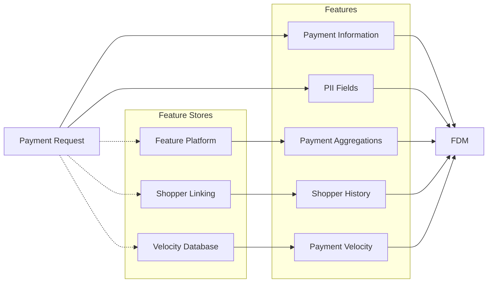
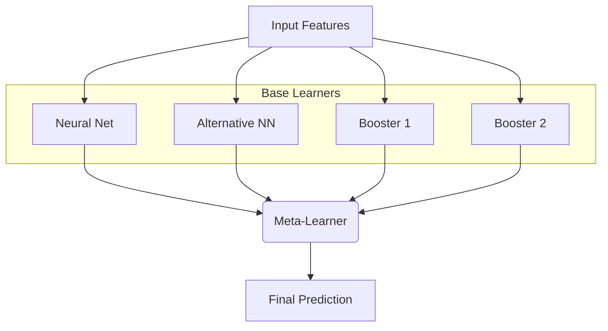
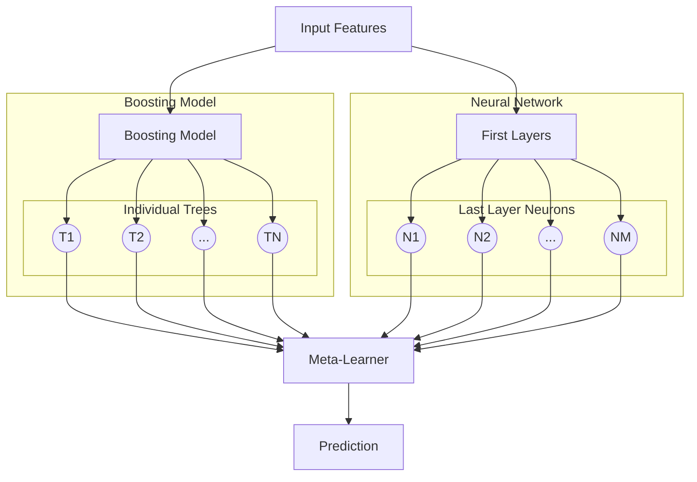
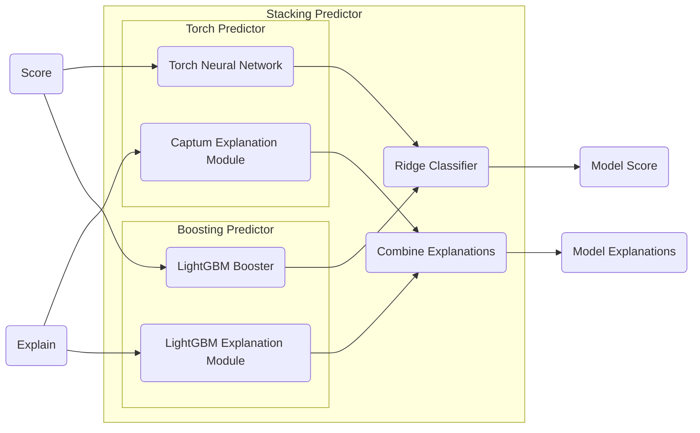

It is a widely held belief in the ML community that tree-based models are the most sensible choice for tabular data and that neural networks will invariably underperform. As a result, using neural networks in this domain is frequently met with skepticism—not only regarding their potential performance, but also their practicality (e.g., latency, GPU requirements, interpretability).

These concerns are empirically motivated <d-cite key="grinsz"></d-cite>, but often misunderstood: for any fixed search budget, tree-based models consistently outperform non–tree-based alternatives. However, we argue that the perceived underperformance often stems from two factors: scale and uncertainty.

First, many empirical comparisons rely on small-scale academic benchmarks that favor sample-efficient tree-based methods while underutilizing neural networks. Second, feasibility concerns often implicitly equate "deep learning" with large language model–style infrastructure, multi-billion-parameter architectures, expensive training pipelines, and complex deployment stacks. However, tabular neural networks need not resemble LLMs in either size or serving complexity.

In this work, we describe the migration of our flagship risk system, scoring thousands of transactions per second, from a large, well-tuned tree-based model to a neural network. We also outline why we believe that, at scale, neural networks can not only match but surpass gradient-boosted trees on tabular data, while bringing substantial ancillary benefits.

## Background

Company processes large volumes of payments for merchants worldwide. A key component of this process is our Fraud Detection Model (FDM), which estimates in real time the likelihood that a payment is fraudulent, allowing the system to approve, challenge, or block transactions accordingly.

The cost of errors is high. Type I errors (blocking legitimate payments) degrade merchant authorization rates and harm shopper experience, while Type II errors (approving fraudulent transactions) lead to direct financial losses. Balancing these trade-offs while maintaining low latency and high throughput is central to the design of our risk models.

Our risk stack consumes a large and evolving feature set, including:

- basic payment-level features
- aggregate features (rolling statistics across merchant and shopper dimensions) computed by our feature platform
- shopper history signals served through our entity-linking system
- velocity features such as recent payment attempts across multiple dimensions
- structured string fields containing raw payment metadata

Historically, our risk stack was built around a large boosting model. It was easy to adopt, straightforward to scale, and strong on tabular data. As a result, model choice was not an immediate bottleneck: most improvements came from feature engineering, platform integration, and expanding model scope. This made a transition to deep learning difficult to prioritize.
Still, we knew that a switch could unlock further gains. Many input signals to the models are inherently sequential (timestamps, event streams) or textual. While engineered feature proxies (e.g., rolling-window aggregates, hashed or bucketed email features) helped, these approaches approximate rather than directly learn from raw signal structure.

Operational pressures also increased over time through a growing transaction volume (billion scale) and increased feature count, which strained out-of-core training and constant-memory inference.. Meanwhile, Company’s long-term strategy emphasized deep learning through work on a foundational payments model, model unification, and multi-task learning.

We hypothesized that a well-designed neural network could provide both first-order performance uplift and second-order benefits such as improved representation learning, reduced feature-engineering burden, better extensibility, and alignment with strategic goals.

## A Performance Path For Deep Learning on Tabular Data

To see why neural networks could eventually outperform tree-based models on tabular data, we must first understand why boosting works so well today.

### Why Tree-Based Models Excel on Tabular Data

Tree-based models remain the dominant choice for tabular tasks because their **inductive bias matches the structure of the data**. Tabular features are often categorical, sparse, piecewise, and highly non-smooth. Trees naturally capture this structure through axis-aligned splits and non-linear rule partitions. A single decision tree already encodes sharp discontinuities and local feature interactions that dense NNs typically struggle with <d-cite key="grinsz"></d-cite>.

Furthermore, the true power of boosting emerges from ensembling. Boosting constructs a large committee of weak learners, each correcting the residuals of the previous one, yielding a flexible and high-capacity model. This *homogeneous ensemble* scales extremely well with modest compute and is sample-efficient—crucial advantages for most tabular benchmarks.

This connects to the **No Free Lunch principle**: no single model class is universally optimal, but an ensemble of diverse models often outperforms any single one.

In short, boosting is particularly effective on tabular data because it combines the **right inductive bias** through trees and a **predictive power multiplier** through ensembling (e.g., bagging, boosting, stacking). 
If we want the benefits of NNs without losing performance, we must replicate *both* components, which we can achieve through heterogeneous ensembling.

### Heterogeneous Ensembling with Deep Learning Models

This observation suggests a natural migration path: extending boosting from a homogeneous ensemble of trees to a heterogeneous ensemble that mixes trees and neural models.

Rather than replacing the tree model outright, we can **stack** multiple learners (e.g., boosters, MLPs, attention models) and train a meta-learner over their predictions. This leverages complementary inductive biases while keeping the stable baseline in place.

Heterogeneous ensembling has repeatedly proven effective in practice<d-cite key="tabarena, tabm"></d-cite>. 
Furthermore, ensembling can serve as a stable bridge that also renders a migration smoother and safer: a neural network can be brought to production in an ensemble instead of directly leaping from one model to the next.
This allows for **immediate incremental uplift** from adding a small neural network to the pre-existing ensemble of trees, **continuous improvement** as the NN architectures mature and
a **safe fallback** to boosting during migration.

While ensembling provides a viable migration blueprint, the issue of inductive bias for neural networks still needs to be addressed.

### Making Neural Networks Competitive on Tabular Data

Despite strong ensembles, neural networks still typically underperform compared to boosting on tabular tasks <d-cite key="tabm"></d-cite>.
The gap is driven by differences in their inductive bias <d-cite key="grinsz"></d-cite>:

1. Smoothness bias — MLPs favor smooth boundaries while tabular patterns are often sharp.
2. Rotational invariance — NNs are rotation-invariant, while trees exploit axis alignment.
3. Scale sensitivity — trees excel on small or medium datasets; NNs need regularization and large amounts of data.

These limitations show that simply throwing NNs on tabular data (without a meaningful budget) is likely to lead to underperformance.

However, recent work <d-cite key="excelformer, realmlp, reg-is-all-you-need"></d-cite> shows these limitations can be alleviated with thoughtful tuning:
- Applying discretization and learned embeddings for continuous values <d-cite key="embeddings"></d-cite>
- Using attention architectures for tabular structures <d-cite key="excelformer"></d-cite>
- Combining large-scale training and augmentation <d-cite key="excelformer"></d-cite>
- Specialized regularization <d-cite key="excelformer, realmlp, reg-is-all-you-need"></d-cite> and activations <d-cite key="excelformer"></d-cite>

Alongside industry reports where NNs eventually outperformed boosting <d-cite key="facebook, stripe, sharechat, swiggy"></d-cite>, these results suggest that designing the right inductive bias for NNs — and ensembling them during migration — can lead them to match or surpass boosted trees at scale.

In the next section, we describe how we operationalized and tested this hypothesis at Company.

## A Practical Approach to Migrating to Deep Learning

The complete transition of our fraud detection models from ML to DL ranged from October 2024 to September 2025. Given the uncertainties regarding the performance and deployability of neural networks and ensembling models, we avoided a large-scale monolithic migration and instead focused on shorter, iterative experiments.

### Offline Experiments

We ran an initial feasibility study to evaluate the performance of neural networks against our boosting model baseline. For simplicity (and arguably lack of nuance), we used the existing boosting feature set unmodified. We built a lightweight experimentation loop focused on rapid iteration rather than production readiness.
We initially experimented with simple MLP and ResNet<d-cite key="gorishniy2023revisitingdeeplearningmodels"></d-cite> architectures to novel solutions such as FT-Transformer (attention-based models for tabular data)<d-cite key="gorishniy2023revisitingdeeplearningmodels"></d-cite>, TabNet<d-cite key="arik2020tabnetattentiveinterpretabletabular"></d-cite>, and ExcelFormer <d-cite key="excelformer"></d-cite>.

After running multiple training and tuning experiments, we observed that neural networks overall underperformed by 18% to 30% on our internal metrics versus our boosting baselines across a combination of architectures and encoding schemes:

- On the architecture side, we surprisingly observed that performance metrics did not significantly differ across architectures: simple architectures such as MLP and ResNet were just as good (or, in this case, just as bad) as complex ones such as FT-Transformer or TabNet, although the latter were shown to bring significant performance uplift on smaller benchmarks <d-cite key="tabred"></d-cite>. Furthermore, model training time increased significantly with the complexity of the architectures on our then fairly immature GPU cluster, rendering the training of some architectures, like ExcelFormer, prohibitively time-consuming.

- On the encoding side, we found that an adequate encoding scheme for numerical and categorical features was essential for acceptable performance from neural networks. Here again, complex encoding schemes such as piecewise linear encoding or numerical embeddings <d-cite key="embeddings"></d-cite> did not bring uplift and sometimes significantly increased training time. A simple combination of standard scaling and masking missing values for numerical features, and learned embeddings for categorical features, gave the best results.

This first run of experiments allowed us to settle, quite surprisingly, on the simplest available architecture: a wide, shallow MLP of around 10M parameters.
This architecture yielded superior performance among the architectures we could train (in a close tie with ResNet) and trained relatively fast, taking around 10 hours at the time to converge on our training sets.

The surprising finding that a simple MLP was the most stable and scalable architecture for our problem shifted our strategy from finding the best architecture to making a simple architecture good at scale. This also matches recent findings in the literature <d-cite key="realmlp"></d-cite><d-cite key="facebook"></d-cite>.

### Ensembling as a Bridge

We then turned our efforts to the stacking ensemble strategy that would best complement the MLP architecture.
We used a simple ridge classifier as our meta-learner and compared two popular forms of stacking:
- A *simple* stacking scheme in which the predictions of the MLP and the boosting model are fed as two inputs to the meta-learner. This is the most basic form of stacking, as the meta-learner receives only two input features with no extra information about the sample it is scoring.
- A *deep* stacking scheme in which the predictions of each individual tree from the booster and activations from the second-to-last layer of the MLP are fed to the meta-learner. This allows for a richer representation of the underlying sample being scored <d-cite key="facebook"></d-cite>.

While stacking models added complexity to the codebase, training them was extremely quick and straightforward.
Both forms of stacking showed uplift compared to our standalone MLP trained in our first experimental round, which was somewhat expected.
However, their individual performance was quite surprising.
On the one hand, the simple two-input stacking scheme showed a 3.8% uplift against our flagship boosting model.
On the other hand, the deep stacking scheme, although passing substantially more information to the meta-learner, underperformed by 10.8% against the same baseline.

| Model                  | Performance vs. Boosting |
| :--------------------- | :----------------------- |
| Standalone MLP         | -18.0%                   |
| Stacking (Simple)      | +3.8%                    |
| Stacking (Deep)        | -10.8%                   |

These results were encouraging since stacking provided direct uplift compared to boosting.
Furthermore, there were several unexplored approaches that could provide future performance gains on the neural network side: we had done no feature engineering, hyperparameter tuning was kept minimal, and the network architecture was extremely simple.

Given these prospective improvements, we prioritized exploratory work on the transition of the model in production through stacking as it provided a great migration strategy: it gave immediate incremental gains without directly replacing the boosting models and offered a safety net while the neural network matured.

However, we remained cautious due to the numerous unknowns regarding its deployability and latency in the live payment flow.

### Live Validation

The next essential step of the migration was validating whether the performance gains obtained through stacking offline could be achieved in production.

More specifically, we wanted to ensure that our stacking model could correctly score transactions in production while respecting our strict latency requirements.

The simple stacking scheme we settled on made it trivial to combine the boosting model and neural network to fulfill the two model interfaces that would be called in production: `score`, which requests a probability of fraud for a transaction, and `explain`, which generates merchant-facing signals explaining the model's decision.

We initially deployed the stacking model on our datacenters in a *ghost* state, in which it scored duplicated versions of live payments without influencing their outcomes, allowing us to monitor model behavior with minimal risk.
The average latency of the stacking model was around 12 ms (versus 5 ms for the boosting model), which was significantly under our latency requirements.
These results showed that CPUs are more than sufficient for real-time inference, which validated one of the core hypotheses of this work, that DL likely does not need GPUs at serving-time.

We then gradually rolled out the stacking model to influence payments, with a stacking setup still dominated by our boosting model.

### Scaling and Transition

With a strong stacking model online, we had time to invest in neural network-specific model improvements with the aim of matching or outperforming stacking to complete the migration.
To gauge progress, we tracked the relative importance of boosting and the neural network within the ensemble over time.

We ran a large number of parallel experiments to iteratively improve the model: feature encoding, feature engineering, loss function, and training stability were all revisited and meaningfully changed.
These incremental changes increased the importance of the neural network within the stacking model, reducing its dependence on trees. 



Finally, we fully switched to the standalone neural network once we observed that it consistently matched or outperformed the stacking model. The stacking strategy we adopted made the entire transition seamless, as the model could just be deployed to production while a stacking fallback was still available.

## Learnings

Our migration from a mature boosting model to a pure deep learning model yielded a number of lessons that we believe generalize beyond our specific domain.

**Start with the simplest possible uplift**
The goal of the first experiments was not to "beat" boosting with a sophisticated neural network architecture but to obtain **any credible uplift** in a way that built trust for the rest of the migration.
A very simple MLP, combined with a simple two-input stacking scheme, was enough to show measurable gains over the flagship boosting model.
This uplift unlocked further investment and bought time for the subsequent transition phases.

**Use ensembling as a bridge, not a destination**
Ensembling was invaluable as a **migration tool**.
It allowed us to gradually and safely introduce deep learning into a critical production system while improving performance and maintaining a reliable fallback.
At the same time, we treated stacking as a bridge rather than a permanent architecture.
Once the neural network consistently dominated the ensemble, the additional complexity of stacking no longer justified itself.

**Separate feasibility from full productionisation**
We deliberately separated the question "Can this model run in production at all?" from "Can it replace the existing model everywhere?".
The initial production deployment focused on **feasibility** by ensuring correctness and speed in the payment flow.
Only once these constraints were verified did we invest in making the DL model a first-class citizen in the main training and deployment workflows.

**Invest in tooling and speed early**
Many of the most impactful investments were not in model architecture but in **tooling** such as workflows with fast feedback, efficient data loaders and GPU-aware training pipelines.
Shortening our experimentation loop made it easier to iterate on architectures and features.
Without this tooling, it would have been tempting to over-index on one-off model tweaks rather than systematic improvement.

**Do not underestimate simple architectures at scale**
On our million-scale tabular problem, a ResNet-style MLP ultimately outperformed more complex tabular DL architectures from the literature.
These more complex models tended to be harder to train, slower, and offered little upside once we accounted for our data scale and operational constraints.
This shows that at our scale a **simple and robust** architecture was a better fit than a complex and novel one.

## Future Work

While the migration is a success in itself that already brought performance improvements in production, we still believe that most of the uplift that neural networks can bring in our domain is yet to be realized.
Among these future avenues, we identify:

- **Multi-task and multi-objective modelling.** 
Now that the core risk model of Company is powered by a neural network, it becomes easier to consider integrating other domain-specific risk models (e.g. card testing or abusive refunds detection) in a multi-task risk model or using multi-objective losses that balance fraud, customer experience, and operational costs. This could leverage the specificities of these multiple models in a large unified network, and greatly reduce operational overhead.

- **Closer integration with foundation models.** 
Company has ongoing work on foundation models for payments. A deep learning-based fraud model provides a natural anchor for integrating such models, whether through shared embeddings, pretraining on large-scale transaction data, or joint training for related tasks.

- **Better use of structured and semi-structured fields.** 
We have only started to exploit the potential of structured fields like anonymised emails or sequence-based velocity features in FDM's neural network. There is ample room for better architectures and regularisation schemes tailored to these modalities.

- **Benchmarks that reflect production constraints.**  
Our experience suggests that small academic tabular benchmarks do not fully capture the realities of large-scale production systems where latency, explainability, and stability matter as much as raw performance metrics.
Designing benchmarks that incorporate these dimensions could lead to architectures and training schemes that transfer more directly to real-world deployments.

- **Characterising when NNs should replace trees.**  
Finally, we would like to better understand, in a more principled way, when deep learning is likely to dominate gradient-boosted trees in tabular settings. Factors such as data size, feature types, temporal structure, and available infrastructure all play a role. Formalising these trade-offs could help teams decide when to invest in a migration like the one described here.

We hope that this case study, and the concrete migration pattern we followed – from offline experiments, to stacking, to a full deep learning model – can serve as a practical blueprint for teams considering a migration path from ML to DL in production — not by replacing everything at once, but by moving *one reversible step at a time*.