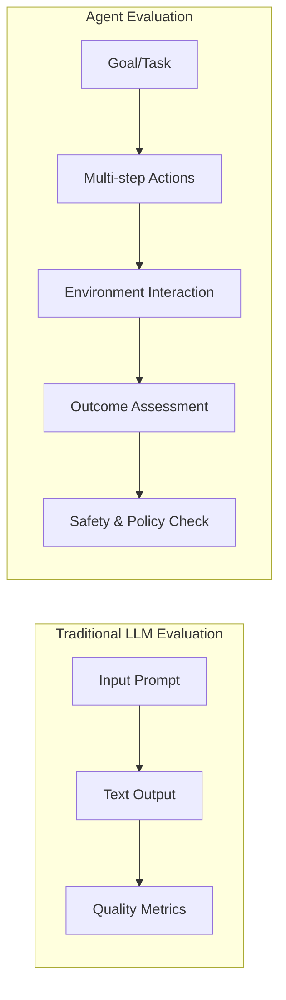
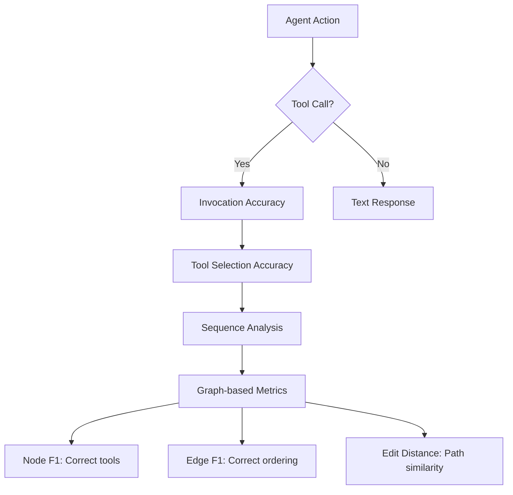

## Introduction

As Large Language Models (LLMs) evolve from standalone text generators into **autonomous agents** capable of taking actions in the real world, the way we evaluate them must fundamentally change. Traditional benchmarks that measure text quality or accuracy are no longer sufficient. We need evaluation frameworks that assess whether agents can perform multi-step tasks in dynamic environments to achieve goals in a reliable and safe way.

This blog provides a hitchhiker's guide to the emerging field of agent evaluation. It begins by detailing the key distinctions from traditional LLM evaluation, and then describes how these differences affect evaluation solutions. We organize the paper around the main questions that can allow easy entrance to newcomers to the field.

---

## How Do LLM and Agent Evaluation Differ?

The shift from LLMs to agents introduces three fundamental changes in evaluation philosophy:

### Single-step vs. Multi-step

LLM benchmarks mostly assess one-step tasks. Agents handle **long-horizon tasks** requiring planning and multiple steps. For example, the SWE-bench coding tasks require editing multiple functions and files to fix a bug, going far beyond single-line code generation <d-cite key="jimenez2023swebench"></d-cite>. Similarly, τ-bench tasks involve multi-turn dialogues with tools and database queries, which standard LLM evaluation would not capture <d-cite key="yao2024tbench"></d-cite>.

<blockquote>
To make an analogy, LLM evaluation is like examining the performance of an engine. In contrast, agent evaluation assesses a car’s performance comprehensively, as well as under various driving conditions.
</blockquote>

### Output vs. Outcome

Traditional LLM evaluation focuses on **text-generation quality**, accuracy on a benchmark, likelihood scores, or fluency metrics. Agent evaluation, by contrast, focuses on **task completion**. We care about whether a goal is achieved (e.g., a flight booked, GitHub issue solved), not just the plausibility of generated text <d-cite key="mohammadi2025survey"></d-cite>.

### Passive vs. Interactive

Agents operate in **dynamic environments**, interacting with users or APIs. This means evaluation must account for interactivity and adherence to external rules. For instance, τ-bench highlights that an agent must gather user information, call backend APIs, and follow domain-specific policy rules during a conversation. Safety also becomes critical: unlike pure LLM tasks, an agent evaluation must check for policy compliance and avoidance of unsafe actions (e.g. deleting the code base) <d-cite key="levy2024stwebagentbench"></d-cite>.

---

## What Does Agent Evaluation Actually Measure?

### Model vs. System Performance

When evaluating a fixed agent framework, performance reflects the underlying LLM's capability (e.g., tool-calling accuracy, reasoning). In this case, we are effectively measuring the model's problem-solving ability on multi-step agentic tasks.

By contrast, when comparing different agent architectures or "scaffolds," the evaluation measures the full agent architecture. Leaderboards like the ones for SWE-bench and AppWorld have more focus on evaluating the different scaffolds and not only the model itself. More broadly, the **Holistic Agent Leaderboard (HAL)** conducts standardized trials across many tasks and frameworks to isolate architectural effects <d-cite key="kapoor2025hal"></d-cite>. For example, HAL ran 21,730 rollouts over 9 LLMs, 9 different agent "scaffolds," and multiple benchmarks (coding, web navigation, etc.), revealing how agent design (e.g., planning algorithm, memory use) affects success.

### Primary Metrics

Most agent benchmarks report **success rates** or **task completion percentages** as the main metric (analogous to accuracy). These metrics test whether the agent was able to achieve the task, but other auxiliary measures are needed for evaluating the multi-step agent actions (trajectory) quality and efficiency of the agent, as pointed out by the AI-Agent that matters paper. Auxiliary measures include:

| Metric Type | Examples |
|-------------|----------|
| Primary | Success rate, task completion % |
| Efficiency | Latency, token cost, number of steps |
| Partial Credit | Subtask completion, milestone-based accuracy |
| Trajectory Quality | Action sequence correctness, tool usage accuracy |

Other metrics from traditional NLP (perplexity, F1) are rarely appropriate for agents because the "text output" is just one small part of the process. Instead, agent evaluation often includes metrics for action sequences, tool usage, and end-state correctness. This change reflects a higher focus on semantic evaluation than on syntactic one.

---

## How to Evaluate Agent Reliability and Safety?

Beyond raw performance, agents must demonstrate **reliability** and **safety**. This section covers three critical dimensions.

### Consistency Metrics

Because LLM agents are nondeterministic, it is not sufficient to only measure the agent success rate; we also need to measure how reliably an agent performs a task over multiple runs. Common metrics are **pass@k** and **pass^k** rates <d-cite key="yao2024tbench"></d-cite>:

$$
\text{pass@}k = \text{Success in one of } k \text{ attempts}
$$

$$
\text{pass}^k = \text{Success in all } k \text{ attempts}
$$

Where:
- Success is defined by the task completion metric
- $k$ is the number of attempts
- **pass@k** represents the agent's ability to succeed *at least once* in $k$ attempts
- **pass^k** represents the agent's ability to succeed on *every one* of $k$ trials

<d-footnote>The pass@k metric is useful for scenarios where you can retry, while pass^k is crucial for production systems where consistent performance is required.</d-footnote>

For example, τ-bench explicitly introduced pass^k to quantify agent consistency. In practice, modern agents often have high pass@1 but rapidly falling pass^k. Yao et al. report that **GPT-4's success on τ-bench drops from ~61% (pass@1) to only ~25% for pass^8**, underscoring that a good agent must not only succeed sometimes, but succeed consistently.

### Policy Adherence

In interactive or enterprise settings, agents must obey rules or policies. Benchmarks now include safety constraints as part of the task. For instance, **ST-WebAgentBench** explicitly provides a hierarchy of organizational policies and measures whether the agent completes the task under those policies <d-cite key="levy2024stwebagentbench"></d-cite>.

A proposed metric is **Completion under Policy (CuP)**, which gives credit only if no policy is violated. Studies find that state-of-the-art agents often fail on these criteria—for example, many succeed at completing a web task but ignore critical safety rules. These metrics are especially important for high-risk organizational agents.

### Adversarial Safety Tests

Additional evaluations probe harmful or unsafe behaviors by design. For example, the **CoSafe benchmark** feeds agents adversarial prompts (e.g., requests for illicit instructions) and measures the rate of unsafe completions <d-cite key="pan2024cosafe"></d-cite>. Other tests like **AgentHarm** quantify the agent's tendency to produce disallowed content.

In practice, one might report the percentage of trials in which the agent violates a safety rule (akin to a "failure rate" under adversarial stress). These measures complement success metrics, ensuring an agent is not only effective but also aligned with ethical and safety standards.

---

## How to Evaluate Agent Trajectories?

Beyond final outcomes, understanding *how* an agent arrives at its solution is crucial. This section covers trajectory-level evaluation.

### Milestones and Subgoals

Many agent tasks are naturally hierarchical. Benchmarks often define intermediate checkpoints or key subgoals along the trajectory. For instance, **TheAgentCompany** benchmark explicitly designs tasks that require many consecutive steps and provides partial credit for completing subtasks <d-cite key="xu2024theagentcompany"></d-cite>. Likewise, **WebCanvas** measures success rates at "key nodes" in the workflow <d-cite key="zhou2024webcanvas"></d-cite>.

By breaking a task into milestones, evaluators can compute metrics like:
- Fraction of subtasks achieved
- Milestone-based accuracy
- Progress score (even for failed tasks)

This provides a finer-grained view of progress than a single binary outcome.

### Agent-as-a-Judge

A recent trend is to use LLMs (or agents) themselves to evaluate trajectories. The **LLM-as-a-Judge** paradigm employs a large model to score or critique an agent's multi-step output <d-cite key="zhuge2024agentjudge"></d-cite>.

For example, Zhuge et al. (2024) propose an **Agent-as-a-Judge** framework: multiple AI agents read an execution trace and vote on success. Such approaches can automatically assess factors like:
- Logical consistency
- Goal alignment
- Efficiency of the solution path

They remain experimental, but they show promise for scalable, subjective evaluations.

### Tool-Call Analysis

Since agent interaction with its environment is based on tool calling, evaluating the sequence of tool invocations is critical. Key questions are:
- Did the agent call the **right tools**?
- Were they called in the **right order**?

Metrics include <d-cite key="mohammadi2025survey"></d-cite>:

| Metric | What it Measures |
|--------|------------------|
| Invocation Accuracy | Was a tool call needed at each step? |
| Tool Selection Accuracy | Was the correct tool chosen? |
| MRR/NDCG | Ranking quality of tool selection |
| Node F1 | Correct tools chosen (graph-based) |
| Edge F1 | Correct ordering of tools |
| Normalized Edit Distance | Similarity to reference trajectory |

In addition, **execution-based evaluation** runs the tool calls to verify they produce the right output. For instance, **GorillaBench** executes each proposed function call to verify it produces the right output <d-cite key="patil2023gorilla"></d-cite>. Similarly, τ-bench applies the tools to measure if the agent achieves the desired database state.

---

## What Are the Big Open Problems & Research Questions in Agent Evaluation?

Despite rapid progress, several fundamental challenges remain in agent evaluation.

### Scalability

Current agent evaluations are **resource-intensive**. Running complex tasks with many trials (especially using large models) can cost thousands of dollars. HAL's evaluation harness reduced wall-clock time, but still required 21,730 agent rollouts across 9 benchmarks at a cost of about **\$40,000** <d-cite key="kapoor2025hal"></d-cite>. Moreover, creating evaluation data is time and cost intensive, making it hard to evaluate agents on new domains.

Future work must improve:
- Efficient evaluation: achieving comparable evaluation signal with fewer resources
- Automation: automate synthetic benchmark creation with LLM-based pipelines

### Cost-Efficiency

As model inference is expensive, a key question is how to balance performance against computational cost. HAL, for example, emphasizes **Pareto frontiers of accuracy vs. inference cost** <d-cite key="kapoor2025hal"></d-cite>.

Such multi-objective evaluation is still nascent: we need standardized ways to report cost (token usage, latency, cloud bills) alongside success rates. Without this, improvements may hide astronomical costs.

### Long-term Autonomy

Evaluating agents over extended interactions remains challenging. Most benchmarks cover **minutes-long tasks**; long-term autonomy would involve days or continuous deployment.

Some recent efforts study simulated multi-day environments, or tasks with long-horizon goals. However, metrics for tracking sustained goal achievement or adaptation over time are still underdeveloped. How do we measure an agent's ability to pursue a goal if the task evolves over hours or days? This "life-long" evaluation is an open frontier.

### Generalist Agents

Many benchmarks focus on narrow domains, but we aspire to agents that generalize across tasks and environments. Evaluating such **generalist agents** requires broad, heterogeneous test suites.

TheAgentCompany attempted this by mixing coding, management, and finance tasks; even so, the best agent solved only **~24% of tasks** <d-cite key="xu2024theagentcompany"></d-cite>, highlighting the difficulty.

Open questions include:
- How to aggregate performance across diverse tasks (weighted averages, worst-case)?
- How to design benchmarks that fairly test versatility?
- How to maintain agent and environment generality when producing a general agent evaluation framework?

---

## Conclusion

Agent evaluation is at an exciting inflection point. As LLMs become autonomous actors in the world, we need evaluation paradigms that go beyond text quality to assess:

1. **Task completion** over long horizons
2. **Safety and policy compliance** in interactive settings  
3. **Consistency and reliability** across multiple runs
4. **Trajectory quality** including tool usage and intermediate steps
5. **Cost-efficiency** and scalability of the evaluation itself

The benchmarks and metrics described here—from SWE-bench and τ-bench to HAL and ST-WebAgentBench—represent important first steps. But as agents become more capable and are deployed in higher-stakes domains, the evaluation frameworks must continue to evolve.

For practitioners, the key takeaway is: **don't just measure if your agent works, measure if it works safely, consistently, and efficiently**. For researchers, the open problems in scalability, long-term autonomy, and generalist evaluation offer rich opportunities for contribution.

The hitchhiker's guide to agent evaluation is still being written—and there's plenty of galaxy left to explore.

